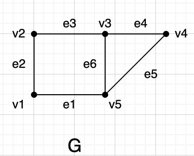

## ch10.10
> 已知图$G$ 的基本关联矩阵为:
$$
B_f(G) == 
\begin{pmatrix} 
1\ 1\ 0\ 0\ 0\ 0\\
0\ 1\ 1\ 0\ 0\ 0\\
0\ 0\ 1\ 1\ 0\ 1\\
0\ 0\ 0\ 1\ 1\ 0\\
\end{pmatrix}
$$

> 求$G$的基本圈矩阵$C_f(G)$ ,和基本割集矩阵 $ S_f(G)$

由$B_f(G)$ 得
$$
B(G) == 
\begin{pmatrix} 
	&e_1&e_2&e_3& e_4&e_5&e_6 \\
v_1&1 & 1 & 0 & 0 & 0 & 0 \\
v_2&0 &1  & 1 & 0 & 0 & 0 \\
v_3&0 &0  & 1 & 1 & 0 & 1 \\
v_4&0 &0  & 0 & 1 & 1 & 0 \\
v_5&1 &0  & 0 & 0 & 1 & 1 \\

\end{pmatrix}
$$

图$G$ 如下:

得$C_f(G)$
$$
C_f(G) = 
\begin{pmatrix}
e_3 & e_4 & e_1& e_2& e_5&e_6 \\
1 & 0 & 1& 1& 0&1 \\
0 & 1 & 0& 0& 1&1 \\
\end{pmatrix}
$$
根据公式$G_f(G) = (I_{\varepsilon-\nu+1 } : C_{12}) ,\ \ \  S_f(G) = (S_{11}:I_{\nu-1}) , \ \ S_{11} = C_{12}^T$ 得
$$
S_f(G) =
\begin{pmatrix}
e_3 & e_4 & e_1& e_2& e_5&e_6 \\
1 & 0 & 1& 0& 0&0 \\
1 & 0 & 0& 1& 0&0 \\
0 & 1 & 0& 0& 1&0 \\
1 & 1 & 0& 0& 0&1 \\
\end{pmatrix}
$$

## ch10.18

> $T1$ 与$T_2$ 是$G$ 的两颗生成树，相应的基本圈矩阵分别为$C_f^{(1)}(G)$ 与$C_f^{(2)}(G)$。
>
> 证明：$C_f^{(2)}(G)$  可以由$C_f^{(1)}(G)$ 通过初等变换得出

证明：

设$C_f^{(2)} (G) = (C_{21},C_{22},···C_{2(v-1)})^T$ , $C_f^{(1)} (G) = (C_{11},C_{12},···C_{1(v-1)})^T$

$C_f^{(1)} (G)$ 为基本圈矩阵，则圈空间中的任意向量可以由$\{ C_{11},C_{12},···C_{1(v-1)} \}$  线性表示。

 $C_f^{(2)} (G)$ 为基本圈矩阵 ，则向量$\{C_{21},C_{22},···C_{2(v-1)}  \}$ 均为圈空间中的向量。

所以， 对所有的$1\le i \le v-1 $ 都有 $a_i = (a_{i1} , a_{i2} ,··· ， a_{i(v-1)}) , a_{ij}\in F_2$  ， 使得

$C_{2i} = a_{i1}*C_{11} + a_{i2}*C_{12} + ··· + a_{i(v-1)}C_{1(v-1)}  = a_i * C_f^{(1)}(G)$   ， 

令$A = (a_1,a_2,···，a_{v-1} )^T$, 则 $C_f^{(2)} (G) = A * C_f^{(1)}(G)$

即$C_f^{(2)}(G)$  可以由$C_f^{(1)}(G)$ 通过初等变换得出

## ch10.13

> 已知开关函数$f_{ab}$ ， 画出相应的简单开关网络。
>
> （1） $f(a,b) = x_1x_3 + x_1x_2x_5 + x_2x_3x_4 + x_4x_5$

+ 第一步写出$f(a,b)$ 各项对应向量为行组成的矩阵。
  $$
  M(a,b) =
  \begin{pmatrix}
  x_1 & x_2 & x_3& x_4& x_5 \\
  1 & 0 & 1& 0& 0 \\
  1 & 1 & 0& 0& 1 \\
  0 & 1 & 1& 1& 0 \\
  0 & 0 & 0& 1& 1 \\
  \end{pmatrix}
  $$

+ 第二步记$x_0 = a b$ 写出$G+x_0$ 中含$x_0$ 的圈向量构成的矩阵
  $$
  C_1(a,b) =
  \begin{pmatrix}
  x_1 & x_2 & x_3& x_4& x_5 &x_0\\
  1 & 0 & 1& 0& 0 &1\\
  1 & 1 & 0& 0& 1 &1\\
  0 & 1 & 1& 1& 0 &1\\
  0 & 0 & 0& 1& 1 &1\\
  \end{pmatrix}
  $$

+ 第三步，在$F_2$  域内化简上式。
  $$
  \bar{C_1}(a,b) =
  \begin{pmatrix}
  x_1 & x_2 & x_4& x_3& x_5 &x_0\\
  1 & 0 & 0& 1& 0 &1\\
  0 & 1 & 0& 1& 1 &0\\
  0 & 0 & 1& 0& 1 &1\\
  0 & 0 & 0& 0& 0 &0\\
  \end{pmatrix}
  $$
  用他的前三行构成$G+x_0$ 的基本圈矩阵 。分析得 $\varepsilon = 6 , 6-\nu+1 = 3 $ , 即$\nu = 4$

+ 第四步，利用推论$10.1$ ， 推出 $S_f(G+x_0) $
  $$
  S_f(G+x_0) =
  \begin{pmatrix}
  x_1 & x_2 & x_4& x_3& x_5 &x_0\\
  1 & 1 & 0& 1& 0 &0\\
  0 & 1 & 1& 0& 1 &0\\
  1 & 0 & 1& 0& 0 &1\\
  \end{pmatrix}
  $$

+ 第五步，由$S_f(G+x_0) $ 求出$B_f(G+x_0) $ ，因为$B_f(G+x_0) $ 中的每个行向量，都是断集空间中的向量。
  $$
  B_f(G+x_0) =
  \begin{pmatrix}
  x_1 & x_2 & x_4& x_3& x_5 &x_0\\
  1 & 1 & 0& 1& 0 &0\\
  0 & 1 & 1& 0& 1 &0\\
  1 & 0 & 1& 0& 0 &1\\
  \end{pmatrix}
  $$

+ 第六步，由$B_f(G+x_0) $ 求出$B_f(G+x_0) $ 。

$$
B(G+x_0) =
\begin{pmatrix}
x_1 & x_2 & x_4& x_3& x_5 &x_0\\
1 & 1 & 0& 1& 0 &0\\
0 & 1 & 1& 0& 1 &0\\
1 & 0 & 1& 0& 0 &1\\
0 & 0 & 0& 1& 1 &1\\
\end{pmatrix}
$$

+ 画出开关网络

  
