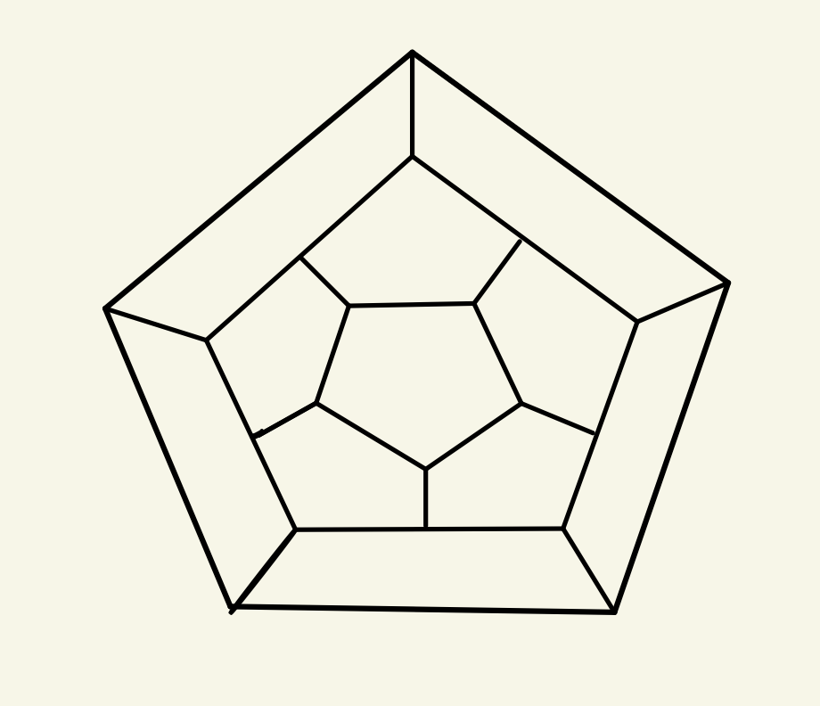
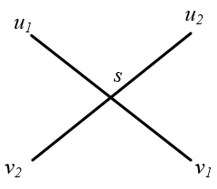

# Ch4

## 2

> 试写出五面体的顶点数和棱数

五面体中不考虑环，其平面图中去掉一个外部面还有四个有界的面

故$v\ge5$

对任意$v_i\in v(G),v_i$至少与同一平面的两个点相邻且至少与其他平面的一个点相邻

得$deg(v_i)\ge 3$

再由握手定理得$\epsilon\ge \frac{3v}{2}$

又因为 $v-\epsilon+\phi=2且\phi=5$

得$\epsilon=v+3$

即$\frac{3v}{2}\le v+3$

从而得$v=5$ 或 $v=6$

## 3

>(1) 证明： 若G是$v>11 $的简单平面图，则$G^c$不是平面图
>
>(2) 试给出一个$v = 8$的简单平面图，使得$G^c$是平面图

- G是简单平面图，则由推论4.2得：$\epsilon(G)\le3v-6$

  设$G^{c}$是平面图，则同理可得$\epsilon(G^{c})\le3v-6$

  又因为$\epsilon(G^{c})+\epsilon(G)=\frac{v(v-1)}{2}$

  故$\frac{v(v-1)}{2}\le 3v-6 +3v-6$，进而得$v^2-13v+24\le0$

  与$v>11$矛盾，故$G^{c}$不是平面图

- 

## 6

> 设G是连通的简单平面图，面数$\phi<12$，最小度$\delta \ge 3$。
>
> (1) 证明G中存在度数小于等于4的面。
>
> (2) 举例说明当$\phi=12$时，其他条件不变，1>的结论不成立。

* 不妨设G是连通图（否则可对他的某连通分支讨论）

  由欧拉公式$v-e+\phi=2$得$\phi=2+e-v <12$，进而解得$v>2+e-12=e-10$。     -----<1>

  又由于$\delta(G)\ge3$以及握手定理可得$2e\ge3v$。                                                                                -----<2>

  将<1>代入<2>得$2e\ge3v>3(e-10)$，进而得$e<30$

  若不存在度数小于等于4的面，则由定理4.3得$2e>5\phi$

  再由欧拉公式得$2e>5\phi=5(2+e-v)$，再将<2>代入得

  $2e\ge10+5e-\frac{10}{3}e=10+\frac{5}{3}e$，进而得$e\ge30$，与之前结论矛盾

  所以G中存在度数小于等于4的面

* 下图为正十二面体图，他是平面图，面数$\phi=12，\delta(G)=3$，可是它每个面的次数均为5。

## 20

> 设$S=\{x_{1}, x_{2}, ... , x_{n}\}$是平面上$n$个点的集合，$n\geq3$，其中任何两点之间的距离至少是1. 证明：最多有$3n-6$个点对，其距离恰好是1.

证明：
不妨设$S$中顶点之间的距离恰好为1，只要证明$G$中最多有$3n-6$条边。
由推论4.2，只要证$G$是平面图即可。
（反证）：
假设有边$u_1v_1, u_2v_2$在除顶点外交叉，交叉点设为$s$。

$\because d(u_1, v_1)=d(u_2,v_2)=1$
$\therefore min\{d(u_1, s), d(s, v_1)\} \leq 1/2, min\{d(u_2, s), d(s, v_2)\} \leq 1/2$
不妨设$d(u_1, s) \leq 1/2, d(u_2, s) \leq 1/2$,
则有$d(u_1, u_2) < d(u_1, s)+d(s, u_2) \leq 1$
即$u_1, u_2$距离小于1，矛盾。
$\therefore$ 图$G$是平面图。得证。