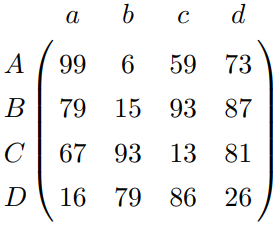
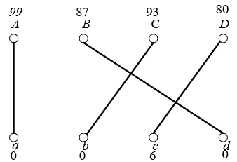

13. 用$Tutte$定理来证明$Hall$定理。
    $Tutte$定理：图$G$（G为一般图，不一定是二分图）由完备匹配$\Leftrightarrow \forall S \subseteq V(G)$，都有$o(G-S) \leq |S|$.
    $Hall$定理：二分图$G, V(G)=X \bigcup Y$，且$X \bigcap Y=\emptyset$，存在将$X$中的顶点都许配的匹配$\Leftrightarrow \forall S \subseteq X$都有$|N(S)| \geq |S|$，其中$N(S)$为$S$的邻顶集合。
    证明：
    对二分图$G=(X,Y,E)$，当$v$为偶数时，加一些边使得$Y$为完全图；当$v$时奇数时，加一些边和顶点$y_0$使得$Y \bigcup y_0$是完全图。图$G$变成完全图$H$，$G$中存在将$X$中所有顶点都许配的匹配的充要条件是$H$有完备匹配。此时$Hall$定理等价于$H$有完备匹配的充要条件是$\forall S \subseteq X, |N_H(S)| \geq |S|$.
    （必要性）：
    $\forall S \subseteq X$, 由$Tutte$定理，$o(H-N_H(S)) \leq |N_H(S)|$
    在$H-N_H(S)$中，$S$中点都是孤立点，所以$|S| \leq o(H-N_H(S))$
    $\therefore |N_H(S)| \geq |S|$.
    （充分性）：
    对$\forall S \subseteq V(H)$，并设$S=S_1 \bigcup S_2$，且$S_1 \bigcup X, S_2 \bigcup Y$.
    因为$Y$是一个完全图，则在$H$中删去$S_1$不会增加连通片个数，且最多产生一个奇片. 删去$S_2$可能会使得$X$中有孤立顶点，设此时$X$中的孤立顶点为$S_3$，则$|N(S_3)| \leq |S_2|$，则有$|S_3| \leq |N(S_3)| \leq |S_2|$
    若$|S_3|=|S_2|$，则$o(H-S_2)=|S_3|=|S_2|$；
    若$|S_3| \leq |S_2|-1$，则$o(H-S_2) \leq |S_3|+1 \leq |S_2|$；
    若$|S_1|$为偶数，则$o(H-S)=o(H-S_2) \leq |S_2| \leq |S|$；
    若$|S_1|$为奇数，则$o(H-S)=o(H-S_2)+1 \leq |S_2|+1 \leq |S|$；
    综上，对$\forall S \subseteq V(H)$，都有$o(H-S) \leq |S|$. 由$Tutte$定理，$H$为有完备匹配的图。
14. 证明：树$T$有完备匹配，当且仅当对任意$v \in V(T)$，都有$o(T-v)=1$。
    证明：
    （必要性）：
    $\because$树T有完备匹配，由$Tutte$定理，$\forall S \subseteq V(T)$, 都有$o(T-S) \leq |S|$.
    令$S=\{v\}$，则$o(T-v) \leq 1$.
    由于树T由完备匹配，即$|T|$为偶数，则$|T-v|$为奇数。
    $\therefore o(T-v) \geq 1$.
    综上，$o(T-v)=1$.
    （充分性）：
    $\forall v \subseteq V(T)$，都有$o(T-v)=1$，则$V(T)$为偶数。
    删去$v$后，树$T$被划分成若干个连通片，且只有一个连通片为奇片，设奇片中与$v$相连的顶点为$u$，在树$T$中，确定一个$v$后，由于$o(T-v)=1$，所以$u$被唯一确定。
    $\therefore e=uv$被唯一确定。
    $\because v$是任意的
    $\therefore$ 所有$v$相对应的$e$的集合就是T的完备匹配。
    综上，树$T$具有完备匹配。

17. 设有四个人$A, B, C, D$，有四分工作$a, b, c, d$，每个人做某份工作的效率如下面的矩阵所示，试求最佳的工作分配方案。

按照$Kuhn-Munkreas$算法一步步计算即可。
构造相等子图$G_l$

$G_l$无完备匹配，取D为未被许配的点，可得：
$Z=\{B, D, c\}$
$S=\{B, D\}$
$T=\{c\}$
$\alpha_l=6$，重新构造相等子图：

最佳分配方案为：$A-a, B-d, C-b, D-c, \omega=99+87+93+86=365$.
19. 证明：$Kuhn-Munkreas$算法中修改顶标后，$\widehat{l}$仍然是可行顶标。
证明：
修改的可行顶标
$$
\widehat{l}=
\begin{cases}
l(v)-\alpha_l& \text{v ∈ S}\\
l(v)+\alpha_l& \text{v ∈ T}\\
l(v)& \text{其他}
\end{cases}
$$
$\alpha_l = min_{x \in S, y \notin T}\{l(x) + l(y) - \omega(x,y)\}$

对$\forall v \in S, u \in Y$,
(1) 若$u \in T$，则$\widehat{l}(v)+\widehat{l}(u)=l(v)-\alpha_l+l(u)+\alpha_l=l(v)+l(u) \geq \omega(u,v)$.
(2) 若$u \in Y \bigcap u \notin T$，
$\because \alpha_l \leq l(v) + l(u) - \omega(u,v)$，
$\therefore \widehat{l}(v)+\widehat{l}(u)=l(v)-\alpha_l+l(u) \geq l(v)+l(u)-(l(v)+l(u)-\omega(u,v)) \geq \omega(u,v)$.
对$\forall v \notin S, u \in Y$,
$\widehat{l}(v)=l(v), \widehat{l}(u) \geq l(u), \widehat{l}(v)+\widehat{l}(u) \geq \omega(u,v)$.
综上，$Kuhn-Munkreas$算法修改顶标后，$\widehat{l}$仍然是可行顶标。