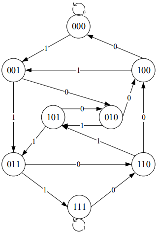
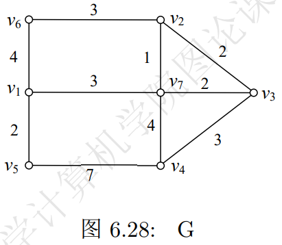
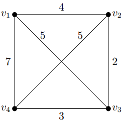
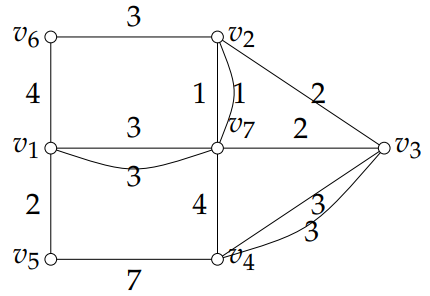
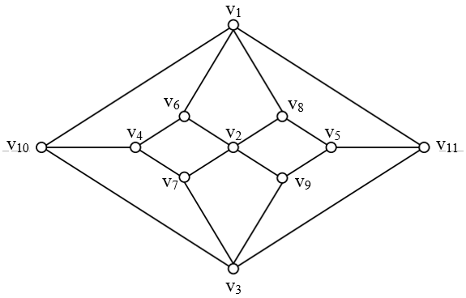

# Ch6

## 1

> Herschel图是否是Euler图？是否能一笔画，为什么？

Herschel图有8个奇数的顶点，但是Euler图要求每个顶点的度数都是偶数，则不是Euler图。

若能一笔画完，则将起点和终点额外连一条线，改图将变为Euler图，但是Herschel图有8个奇数的顶点，只连一条线无法将所有顶点的度数都遍未偶数。

## 3

> 设$G$是恰有$2k$个奇度顶点的连通图，证明：$G$中存在$k$条边不重的行迹$P_{1}, P_{2}, ... , P_{k}$，使得 $E(G)=\bigcup_{i=1}^k E(P_{i})$。

对于奇数顶点$v_1,v_2,...,v_{2k}$，将他们分为$k$组，每一组为$v_i,v_{i+k}$。接下来增加$k$个节点$u_i(i=1,2,...,k)$，然后连接$v_iu_i,v_{i+k}u_i$，这样新的图的每个顶点度数都为偶数，为Euler图。

则节点$u_i(i=1,2,...,k)$及其邻边正好将Euler回路分割成了$k$条设每条为$P_i$。因为是Euler图，所以有$E(G)=\bigcup_{i=1}^k E(P_{i})$。

## 4
> 如何将16个二进制数字（8个0，8个1）拍成一个圆形，使得16个长为4的二进制数在其中都出现且只出现一次。

转化成图论问题。
定义顶点$V(G)=\{所有3位二进制数\}$，定义$E(G)=\{u_iv_j \mid u_i可以通过左移位得到v_j, i,j=1, ..., 8\}$构造图$G$.

每个3位二进制数向左移位，可在其最右补0或1，则每个顶点$v$有$deg^+(v)=deg^-(v)=2$.
由$Thm 6.2$可知图$G$为$Euler$图。
根据其中一条$Euler$回路可构造出排列。
$000 \stackrel{0} {\longrightarrow} 000 \stackrel{1} {\longrightarrow} 001 \stackrel{0} {\longrightarrow} 010 \stackrel{1} {\longrightarrow} 101 \stackrel{0} {\longrightarrow} 010 \stackrel{0} {\longrightarrow} 100 \stackrel{1} {\longrightarrow} 001 \stackrel{1} {\longrightarrow} 011 \stackrel{0} {\longrightarrow} 110 \stackrel{1} {\longrightarrow} 101 \stackrel{1} {\longrightarrow} 011 \stackrel{1} {\longrightarrow} 111 \stackrel{1} {\longrightarrow} 111 \stackrel{0} {\longrightarrow} 110 \stackrel{0} {\longrightarrow} 100 \stackrel{0} {\longrightarrow} 000$

## 8

> 求图6.28的一条最优投递路线。

    使用EJ算法。
    （1）图$G$的奇度顶集$V_0=\{v_1, v_2, v_3, v_4\}$，$\mid V_0 \mid=4$.
    （2）由$Dijkstra$算法：
    $d(v_1, v_2)=4, d(v_1, v_3)=5, d(v_1, v_4)=7$
    $d(v_2, v_3)=2, d(v_2, v_4)=5, d(v_3, v_4)=3$
    （3）构成带权完成图$K_4$:
    
    （4）上图$K_4$的最佳匹配$M=\{v_1v_2, v_3v_4\}$.
    在$G$中$v_1, v_2$间最短轨为$P(v_1, v_2)=v_1v_7v_2, P(v_3, v_4)=v_3v_4.$
    （5）$Euler$图$G^*$如右图：
    

  （6）在图$G^*$找到$Euler$回路即为最优投递路线。
  不妨设出发点（邮局）为$v_6$，则其中一条$Euler$回路为：
  $v_6v_2v_3v_4v_3v_7v_2v_7v_1v_7v_4v_5v_1v_6$

## 9
> 设$G$是二分图，证明：若$G$是$Hamilton$，则$G$必有偶数个顶点。习题1中的图6.27是$Hamilton$图吗？为什么？

证明：设二分图$G=X \bigcup Y, X \bigcap Y=\emptyset$, 若$G$是$Hamilton$，则$\omega(G-X) \leq \mid X \mid$.
$\therefore \mid Y \mid \leq \mid X \mid$.
同理$\mid X \mid \leq \mid Y \mid$.
$\therefore \mid X \mid = \mid Y \mid$.
$\therefore G$有偶数个顶点。
在图6.27中，$\because G=\{v_1, v_2, v_3, v_4, v_5\} \bigcup \{v_6, v_7, v_8, v_9, v_{10}, v_{11}\} = X \bigcup Y$, 且$X \bigcap Y$没有边

$\therefore Herschel$图为二分图，且有11个顶点
$\therefore$不是$Hamilton$图