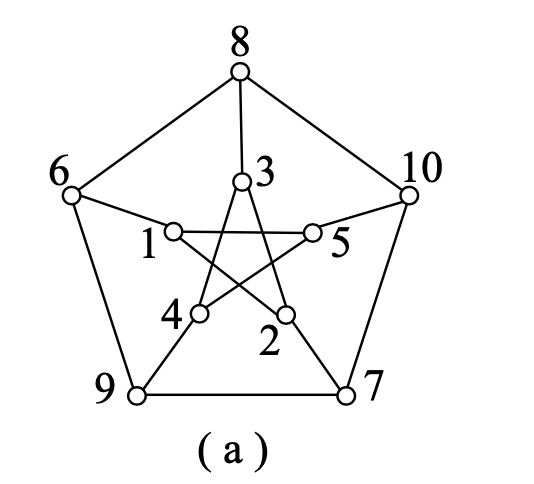
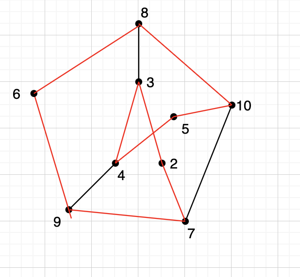
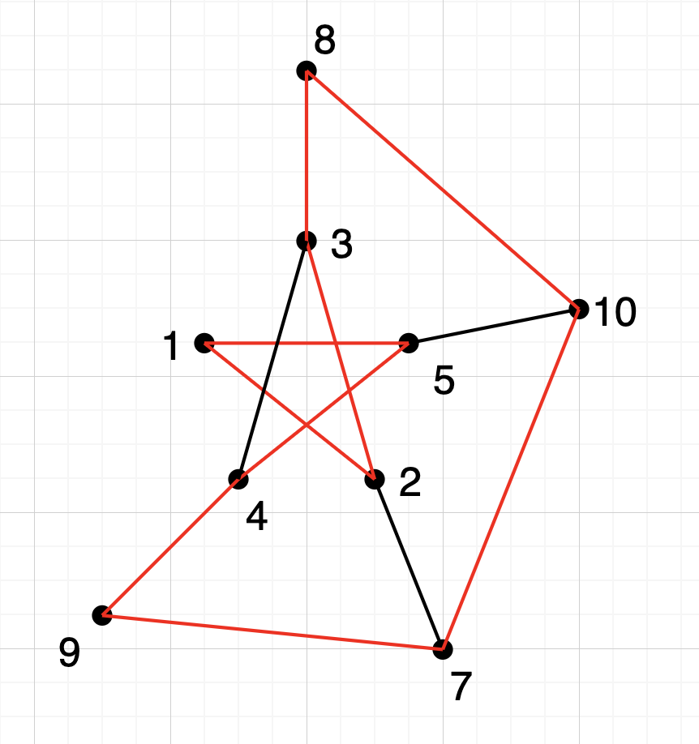
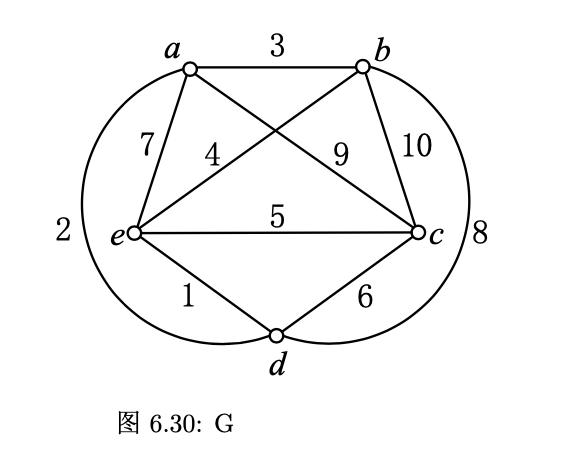
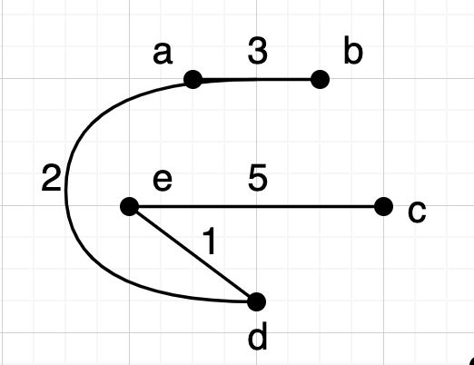
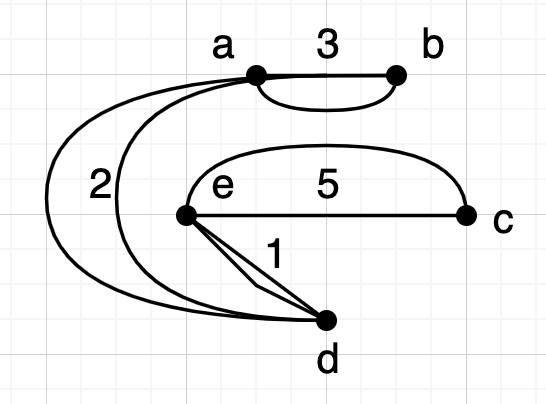
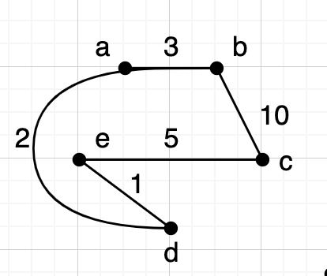

# Ch6

## 1

> Herschel图是否是Euler图？是否能一笔画，为什么？

Herschel图有8个奇数的顶点，但是Euler图要求每个顶点的度数都是偶数，则不是Euler图。

若能一笔画完，则为Euler迹，但是Herschel图有8个奇数的顶点，根据推论6.1显然不成立。

## 3

> 设$G$是恰有$2k$个奇度顶点的连通图，证明：$G$中存在$k$条边不重的行迹$P_{1}, P_{2}, ... , P_{k}$，使得 $E(G)=\bigcup_{i=1}^k E(P_{i})$。

对于奇数顶点$v_1,v_2,...,v_{2k}$，将他们分为$k$组，每一组为$v_i,v_{i+k}$。接下来增加$k$条边$e_i(i=1,2,...,k)$,连接$v_iv_{i+k}$，这样新的图的每个顶点度数都为偶数，为Euler图。

则边$e_i(i=1,2,...,k)$正好将Euler回路分割成了$k$条，设每条为$P_i$。因为是Euler图，所以有$E(G)=\bigcup_{i=1}^k E(P_{i})$。

## 4
> 如何将16个二进制数字（8个0，8个1）拍成一个圆形，使得16个长为4的二进制数在其中都出现且只出现一次。

转化成图论问题。
定义顶点$V(G)=\{所有3位二进制数\}$，定义$E(G)=\{u_iv_j \mid u_i可以通过左移位得到v_j, i,j=1, ..., 8\}$构造图$G$.

每个3位二进制数向左移位，可在其最右补0或1，则每个顶点$v$有$deg^+(v)=deg^-(v)=2$.
由$Thm 6.2$可知图$G$为$Euler$图。
根据其中一条$Euler$回路可构造出排列。
$000 \stackrel{0} {\longrightarrow} 000 \stackrel{1} {\longrightarrow} 001 \stackrel{0} {\longrightarrow} 010 \stackrel{1} {\longrightarrow} 101 \stackrel{0} {\longrightarrow} 010 \stackrel{0} {\longrightarrow} 100 \stackrel{1} {\longrightarrow} 001 \stackrel{1} {\longrightarrow} 011 \stackrel{0} {\longrightarrow} 110 \stackrel{1} {\longrightarrow} 101 \stackrel{1} {\longrightarrow} 011 \stackrel{1} {\longrightarrow} 111 \stackrel{1} {\longrightarrow} 111 \stackrel{0} {\longrightarrow} 110 \stackrel{0} {\longrightarrow} 100 \stackrel{0} {\longrightarrow} 000$

## 8

> 求图6.28的一条最优投递路线。

    使用EJ算法。
    （1）图$G$的奇度顶集$V_0=\{v_1, v_2, v_3, v_4\}$，$\mid V_0 \mid=4$.
    （2）由$Dijkstra$算法：
    $d(v_1, v_2)=4, d(v_1, v_3)=5, d(v_1, v_4)=7$
    $d(v_2, v_3)=2, d(v_2, v_4)=5, d(v_3, v_4)=3$
    （3）构成带权完成图$K_4$:
    
    （4）上图$K_4$的最佳匹配$M=\{v_1v_2, v_3v_4\}$.
    在$G$中$v_1, v_2$间最短轨为$P(v_1, v_2)=v_1v_7v_2, P(v_3, v_4)=v_3v_4.$
    （5）$Euler$图$G^*$如右图：
    

  （6）在图$G^*$找到$Euler$回路即为最优投递路线。
  不妨设出发点（邮局）为$v_6$，则其中一条$Euler$回路为：
  $v_6v_2v_3v_4v_3v_7v_2v_7v_1v_7v_4v_5v_1v_6$

## 9
> 设$G$是二分图，证明：若$G$是$Hamilton$，则$G$必有偶数个顶点。习题1中的图6.27是$Hamilton$图吗？为什么？

证明：设二分图$G=X \bigcup Y, X \bigcap Y=\emptyset$, 若$G$是$Hamilton$，则$\omega(G-X) \leq \mid X \mid$.
$\therefore \mid Y \mid \leq \mid X \mid$.
同理$\mid X \mid \leq \mid Y \mid$.
$\therefore \mid X \mid = \mid Y \mid$.
$\therefore G$有偶数个顶点。
在图6.27中，$\because G=\{v_1, v_2, v_3, v_4, v_5\} \bigcup \{v_6, v_7, v_8, v_9, v_{10}, v_{11}\} = X \bigcup Y$, 且$X \bigcap Y$没有边

$\therefore Herschel$图为二分图，且有11个顶点
$\therefore$不是$Hamilton$图

## 11
> $Petersen$ 图删除一个顶点后是不是$Hamilton$ 图。

**是。$Hamilton$ 图。**

由$Petersen$ 图的对称性可知。$Petersen$ 图有两类顶点。$\{1,2,3,4,5\}$ 一类，$\{6,7,8,9,10\}$ 一类。对去除的顶点分两类讨论。

1. 若去除的点是第一类顶点，不妨设为顶点$1$  。所得的图为:

​	图中红色部分为一个$Hamilton$ 圈$C_0$。 $C_0 =  10 \ 5\ 4 \ 3 \ 2 \ 7\ 9\ 6\ 8\ 10$

2. 若去除的点是第二类顶点，不妨设为顶点$6$  。所得的图为：

​	图中红色部分为一个$Hamilton$ 圈$C_1$。 $C_1 = 3 \ 2\ 1 \ 5 \ 4 \ 9\ 7\ 10\ 8\ 3$

综上：$Petersen$ 图删除一个顶点后是$Hamilton$ 图。

## 14
> 证明：$2k-1$ 阶的$k$ 次正则图是$Hamilton$ 图$(k>2)$ 

**证明：** 

对任意点对$(u,v)$ 有$deg(u) + deg(v) = 2k>2k-1 = \nu(G)$  . 由Ore定理，得证。

## 16
> 若G是二分图，但其顶点的划分$X$与 $Y$不均匀, 即$|X| \neq |Y|$ 。则$G$ 是不是$Hamilton$ 图 ？ 为什么？

不是。

若$G$是$Hamilton$ 图。则$G$中 存在$Hamilton$ 圈 $C$  。 $C$ 中的顶点在$X , Y $中交替出现。则$|X| = |Y|$ 。矛盾

所以，$G $ 不是$Hamilton$ 图。

## 21
> 证明： 设$G$ 是一个简单图，$\nu = |V(G)| \ge 3$ , 如果对满足 $1 \le m \le \nu -2$ 的任意正整数$m$ , 度数不超过 $m$ 的顶点个数小于 $m$ , 则$G$是$Hamilton$ 图.

证明： 
先证命题：$c(G) = K_\nu$
假设$c(G) \neq K_\nu$  。 则$\exist u , v \in G ,  uv \notin c(G)$ 。记$u',v'$ 是这样的点对中 $deg_{c(G)}(u) + deg_{c(G)}(v)$最大的点对 。 
定义$V_0 =\{v | v \in V(G) ,vv' \notin c(G)\}$  。 $V_1 =\{v | v \in V(G) ,vv' \in c(G)\}$  。有$|V_1| = deg_{c(G)}(v')$ , $|V_0| = \nu - 1 - deg_{c(G)}(v') $

令 $ m = deg_{c(G)}(u')$ 。 

由$u',v'$  的定义知  $\forall v\in V_0 ,  deg_{c(G)}(v) +  deg_{c(G)} (v') \le  deg_{c(G)}(u')+ deg_{c(G)}(v') $  ,   即 $\forall v\in V_0 ,  deg_{c(G)}(v)\le deg_{c(G)}(u')$  。 又$\because \forall v \  deg_{G}(v)\le deg_{c(G)}(v) \therefore  $ $\forall v\in V_0 ,  deg_{G}(v)\le m$

由$c(G) $ 定义知 ，$ \ deg_{c(G)}(u') + deg_{c(G)}(v')  \le \nu -1$   。 $\therefore m \le |V_0| $

即度数不超过$m$ 得顶点个数不小于$m$ 。矛盾 , 命题得证。  由推论$6.3$ ,$G$是$Hamilton$ 图.

## 22
> $5$ 阶完全加权图如图$6.30$ 所示。
>
> (1) 用最邻近法求以$a$ 为起点的旅行商问题的近似解；
>
> (2)用最小生成树法求以$a，b$ 为起点的旅行商问题的近似解；
>
> (3)用最小权匹配法求旅行商问题的近似解;

**(1)   用最邻近法求以$a$ 为起点的旅行商问题的近似解；**

$W = 26$

从$a$出发 ， 形成轨道$P_1 = a$ 。 

从$V(G) - \{a \}$中，选取与$a$ 最近的顶点$d$ 。形成 $P_2 = ad$

从$V(G) - \{a ,d \}$中，选取与$d$ 最近的顶点$e$ 。形成 $P_3 = ade$

从$V(G) - \{a ,d,e \}$中，选取与$e$ 最近的顶$b$ 。形成 $P_4 = adeb$

从$V(G) - \{a,d,e,b \}$中，选取与$b$ 最近的顶点$c$ 。形成 $P_5 = adebc$

得$Hamilton$ 圈，$H = adebca$

**(2)用最小生成树法求以$a，b$ 为起点的旅行商问题的近似解；**

1. 求$G$ 的一颗最小生成树$T$.

   
2. 将$T$ 各边加平行边得$G^*$ 

   
从$a$ 出发，求$G^* $ 的一条欧拉回路$C_a = adecedaba $    ，"抄近路" 访问$G$ 的各顶点。得$H_a = adecba$ 。 $W_a = 21$  

从$b$ 出发，求$G^* $ 的一条欧拉回路$C_b = badecedab $    ，"抄近路" 访问$G$ 的各顶点。得$H_b =badecb$ 。 $W_b = 21$  

**(3) 用最小权匹配法求旅行商问题的近似解;**

1. 求$G$ 的一颗最小生成树$T$.

   
2. $T$ 中奇度数顶点得集合为$V_o = \{b , c \}$  , $V_o $的导出子图中总权最小得完备匹配$M = \{bc \} $  , $M $ 加入 $T$ 中得$G^*$

   
3. 在$G^* $ 中求从$a$ 出发得一条欧拉回路$C_a =adecba $

4. 在$G$ 中， 从$a$ 出发，沿$C_a$ 中得边按 ''抄近路'' 走出$Hamilton$ 圈$H_a = adecba$ 

$W = 21$

