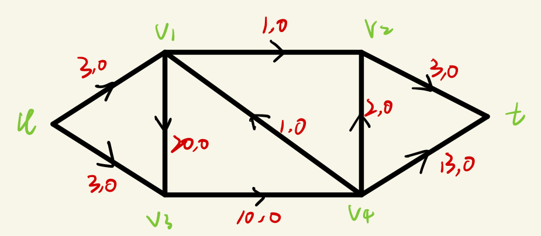
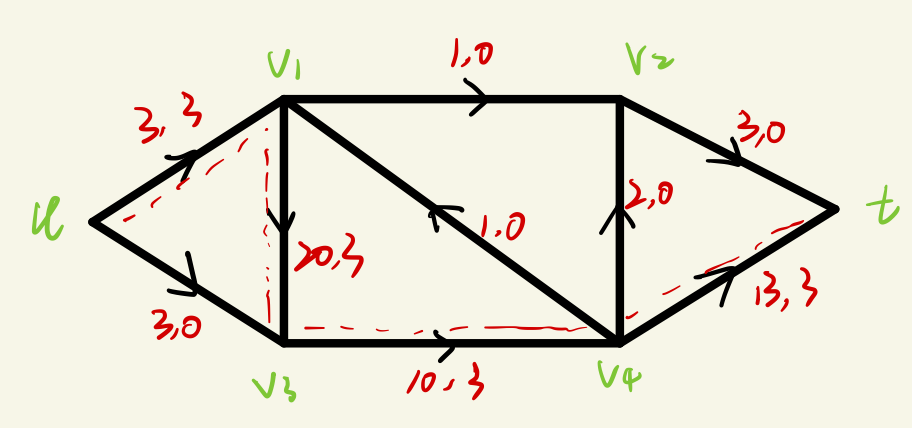
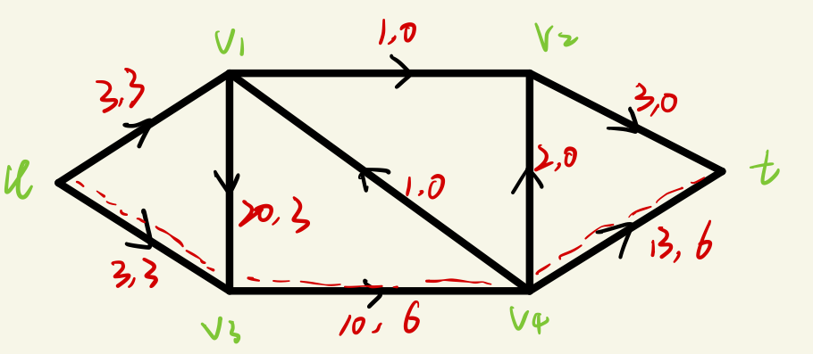

# Ch9

## 1

> 假设f是网络N=(D，s，t，c)上的流函数。证明：
> $$
> \sum_{e\in \alpha(t)}f(e)-\sum_{e\in \beta(t)}f(e) = \sum_{e\in \beta(s)}f(e)-\sum_{e\in \alpha(s)}f(e)
> $$

设$V' = V(G)- \{s,t\}$，由流函数的定义可知，$\forall v\in V'$，有$\sum_{e\in \alpha(v)}f(e) = \sum_{e\in \beta(v)}f(e)$，定义$G'=G\cdot V'$，即将V’收缩为一个点，记为u。（如下图所示）

~~~mermaid
graph LR;
s --> u
u --> s
u --> t
t --> u

~~~

因为对$\forall v\in V'$，有$\sum_{e\in \alpha(v)}f(e) = \sum_{e\in \beta(v)}f(e)$，所以对u，有$\sum_{e\in \alpha(u)}f(e) = \sum_{e\in \beta(u)}f(e)$

又因为
$$
\sum_{e\in \alpha(u)}f(e) = \sum_{e\in \beta(s)}f(e) + \sum_{e\in \beta(t)}f(e) \\
\sum_{e\in \beta(u)}f(e) = \sum_{e\in \alpha(s)}f(e) + \sum_{e\in \alpha(t)}f(e)
$$
故
$$
\sum_{e\in \alpha(t)}f(e)-\sum_{e\in \beta(t)}f(e) = \sum_{e\in \beta(s)}f(e)-\sum_{e\in \alpha(s)}f(e)
$$

## 2

> 假设f是网络N=(D，s，t，c)上的流函数，$X\in V(D)$，证明：
> $$
> \sum_{v\in X}(\sum_{e\in \beta(v)}f(e)-\sum_{e\in \alpha(v)}f(e)) = f^+(X)-f^-(X)
> $$

* (1)

$$
\sum_{v\in X}\sum_{e\in \beta(v)}f(e) = \sum_{e\in (X,X)}f(e) +\sum_{e\in (X,V(D)-X)}f(e)\\
\sum_{v\in X}\sum_{e\in \alpha(v)}f(e) = \sum_{e\in (X,X)}f(e) +\sum_{e\in (V(D)-X,X)}f(e)\\
故 \sum_{v\in X}(\sum_{e\in \beta(v)}f(e)-\sum_{e\in \alpha(v)}f(e)) \\= \sum_{e\in (X,X)}f(e) +\sum_{e\in (X,V(D)-X)}f(e) - (\sum_{e\in (X,X)}f(e) +\sum_{e\in (V(D)-X,X)}f(e))\\
=\sum_{e\in (X,V(D)-X)}f(e) - \sum_{e\in (V(D)-X,X)}f(e)\\
 = f^+(X)-f^-(X)
$$

* (2)

  ~~~mermaid
  graph LR;
  s -->|1|v1 
  v1 -->|1|v2
  v2 -->|1|t
  s -->|2|v3
  v3 -->|2|v4
  v4 -->|2|t
  ~~~

  令**X  = {v1,v2,v3,v4}**，$\sum_{v\in X}\sum_{e\in \beta(v)}f(e) = 6，\sum_{v\in X}\sum_{e\in \alpha(v)}f(e) = 6，f^+(X) = 3，f^-(X) = 3$

## 3

> 证明：若网络中不存在从源s到汇t的有向轨道，则此网络的最大流量个最小截量都是0

令$S=\{v|v\in V(D),存在从s到v的有向轨道 \}$，由题意得$t\notin S$，则$t\in \bar{S}$，$(S,\bar{S})$是网络得一个截。

若$(S,\bar{S})\neq \emptyset ,则存在e=uv\in E(D),u\in S,v \in \bar{S}$

而由S的定义，$v\in S$，矛盾。故$(S,\bar{S})= \emptyset$，即$C(S,\bar{S})=0$，最小截为0

由最大流最小截定理，最大流也为0

## 4

> 求图中网路的最大流
>

* 取初始流，$\forall e\in E(G),f(e)=0$

  

* 可增载轨道$uv_1v_3v_4t$

  

* 可增载轨道$uv_3v_4t$

  

* 无可增载轨道，最大流为6

## 9.5

> 证明：若网络中每条边的容量均为整数，则最大流的流量也一定是整数。

对于任意的截，$C(S,\bar{S})=\sum_{e\in (S,\bar{S})c}c(e)$，因为容量均为整数，故$C(S,\bar{S})$为整数，因此最小截也为整数

由因为最大流最小截定理，最大流等于最小截，故最大流也一定是整数。